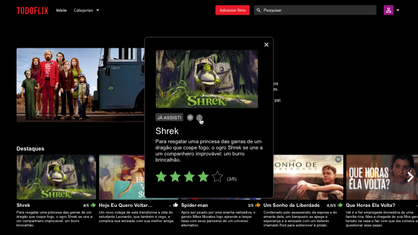
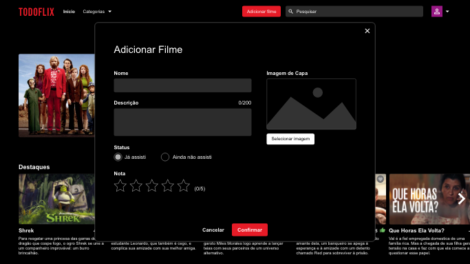
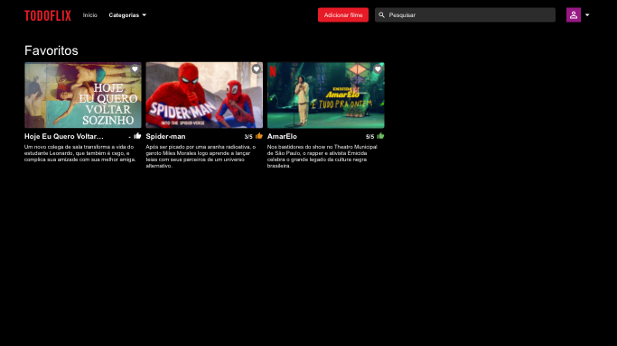
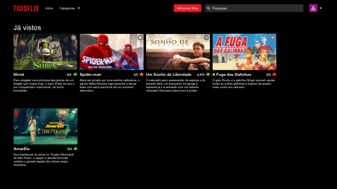

## Desafio final - modulo  II - VNW

#### Desafio nível 1

**Funcionalidades principais:** 
- Layout completo - deixar o desafio o mais próximo possível do XD
- Menu "Categorias" - adicionar :hover no menu "Categorias" mostrando a Rota "TODOS" funcionando e renderizando todos os filmes adicionados
- Botão de adicionar filme - adicionar :hover com bordas (botão apenas visual, sem interação)
- Filter - Filtro funcionando e mostrando na tela o item procurado
- Carrossel - girando para a esquerda, mostrando os filmes adicionados

#### Desafio nível 2

**Funcionalidades principais:**
- Todos os itens do nível 1 devem estar completos antes de avançar para o nível 2
- Menu "Categorias" - adicionar a Rota "FAVORITOS" funcionando e renderizando todos os filmes favoritados
- Botão de adicionar filme - ao clicar, deve aparecer uma caixa contendo os inputs mas não é preciso estar funcional (apenas a marcação da caixa e dos itens)
- Botão de adicionar aos favoritos - ao clicar, o filme selecionado deve ser mostrado na Rota dos filmes favoritos
- Carrossel - ao clicar em algum item do carrossel, deve aparecer uma caixa com informações sobre o filme selecionado e as estrelas (star rating) funcionando

#### Desafio nível 3

**Funcionalidades principais:**
- Todos os itens do nível 1 e 2 devem estar completos antes de avançar para o nível 3
- Menu "Categorias" - adicionar as Rotas "JÁ VISTOS" e "ADICIONADOS" funcionando e renderizando todos os filmes já vistos e adicionados
- Botão de adicionar - ao clicar, deve aparecer uma caixa contendo os inputs de forma funcional (adicionando os dados dos filmes na Rota "TODOS")
- Carrossel - ao clicar em algum item do carrossel, deve aparecer uma caixa com informações sobre o filme selecionado e também a caixa para editar um filme já adicionado anteriormente

**Funcionalidade extra:
Dependendo do número de estrelas dadas ao filme, a cor do botão de like muda de acordo com a pontuação exemplificada no XD.

